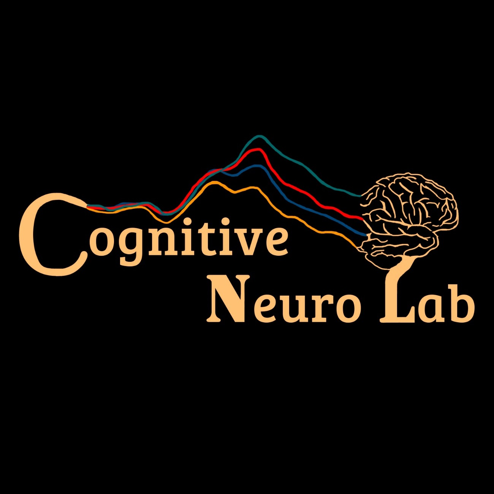

<br />
<p align="center">
  <a href="https://github.com/CognitiveNeuroLab/Illusory-Contours/">
    
  </a> 

<h3 align="center">Illusory Contours</h3>

<h4 align="center"> Illusory-Contours. This task is created as a stand allone study and is later addapted to be part of the Sfari project. It is created for our ASD research. This experiment is coded for Presentation® NeuroBehavioral Systems, and coded in Scenario Description Language (SDL) & Presentation Control Language (PCL)) </h4>


**Table of Contents**
  
1. [About the project](#about-the-project)
    - [Built With](#built-with)
    - [Installation](#installation)
3. [Info about the experiment](#info-about-the-experiment)
    - [Stimuli](#stimuli)
    - [Logfiles](#logfiles)
    - [Sequences](#sequences)
    - [Inter stimulus interval](#inter-stimulus-interval)
    - [Instructions](#instructions)
    - [Task](#task)
    - [Trigger codes](#trigger-codes)
    - [Timing](#timing)
    - [Data collection](#data-collection)
3. [Sfari project changes](#sfari-project-changes)    
3. [License](#license)
3. [Contact](#contact)
3. [Acknowledgements](#acknowledgements)


<!-- ABOUT THE PROJECT -->
## About The Project


### Built With

* [Presentation® (NeuroBehavioral Systems)](https://www.neurobs.com/)

## Installation

[Download this Repo](https://github.com/CognitiveNeuroLab/Illusory-Contours/)

Folder 1 - "Presentation Files" - this folder should contain all the presentation files and Sequences

Folder 2 - "Logfiles"           - this folder will be filled with all the presentation logfiles containing the behavioral data

Folder 3 - "Stimuli"            - this folder will contain all the pictures


## Info about the experiment

### Stimuli

There are 2 stimuli, 1 stimuli that creates the Illusion, and one that seems like a random scramble of circles with a quarter missing.  
  
This is the illusion.  
  
This is the non-illusion stimulus.

### Logfiles

logfiles with experiment reaction times and other information are automatically placed in the logfile folder. In these logfiles you will find the behavioral information of each time the experiment is ran. It is good practice to create a folder with participant ID to separate all these files. 

### Sequences 

Both the location, left center or right, and whether it's a NC or IC image is fully randomized by presentation. 

### Inter stimulus interval  
  
This is a randomly selected number between 800ms and 1400ms. 

### Instructions

The participant is instructed to always pay attention to the square in the center. They should ignore whatever else happens on the screen and click if the square changes color.  
  
### Task  
  
The participant will always see the dot, but it will change color on average every ten seconds (the actual time course is randomized). This color change lasts for 160ms. 

### Trigger codes

The presentation software sends codes to the EEG system so that the responses and the stimuli can be time-locked in the EEG data. The following is an explanation of each trigger code: 

```
port code 100,250   = response
port code 77  = Dot event
port code 21  = IC image, center position
port code 11  = IC image, left position
port code 31  = IC image, Right position
port code 20  = NC image, center position
port code 10  = NC image, left position
port code 30  = NC image, right position
port code 254  = pause on
port code 255  = pause off

```

### Timing
The reason this experiment is coded in presentation, is because of the timing resolution of this software/language. When setup correctly this experiment has potentially 1ms of jitter. This will be measured here at our lab, using an oscilloscope. It is critical that this is re-tested before EEG data is collected. This has not yet happened because we haven't decided on the duration of the trials.

After testing the timing we can now say that the port_code triggers happen at the same time (0ms) with the onset of the stimuli.  
  
  
Here we can see that the stim actually last indeed for 100ms. 
  
  
In both cases we tested this over time for 100s of trials and made sure that across trials it is also stable. 


**if you plan to use this paradigm** 
You need to do the same and test if for your setup the timing is also okay. This timing is dictated by the refresh rate of your screen, the quality of your computer and potentially other minor factors. If you want to change the timing you can change  "deltat = ..". Whenever this shows up in the code it will delay the sending of the trigger by x amount of milliseconds. So in our case we noticed the screen being 9ms delayed, so this is why we delay the trigger by the same amount.  
  
The other thing that is important is the size of the stimuli on the screen. In the origial paradigm they are 9.5cm by 9.5cm. This should be changed if the viewing distance is changed.   
  

### Data collection
This experiment is used to collected EEG data, eye tracking data and RT data.  


## Sfari project changes  
  
1. We are only using the stimuli showing up in the center, so we can reduce the trials (by 3X)  
2. We are saving the eye tracking data  
3. We are not pausing the paradigm if we lose eye tracking  
4. Blocks will be interrupted after 50, 90 and 130 trials with a little 5 sec break for kids to regain focus.   
5. The attention task is in blue and yellow (to reduce the change that color blind people wouldn't be able to see the change)

## License

Distributed under the MIT License. See [LICENSE](https://github.com/CognitiveNeuroLab/ASSR-oddball/blob/master/LICENSE.txt) for more information.


## Contact

Main project - [Emily Knight](https://www.urmc.rochester.edu/pediatrics/developmental-and-behavioral-pediatrics/our-fellows.aspx) - [Github](https://github.com/eknight3) -  emilyj_knight@urmc.rochester.edu  
Sfari version - [Douwe Horsthuis](www.douwehorsthuis.com) - [Github](https://github.com/DouweHorsthuis) - douwehorsthuis@gmail.com

Project Link: [https://github.com/CognitiveNeuroLab/Illusory-Contours](https://github.com/CognitiveNeuroLab/Illusory-Contours)


## Acknowledgements
  
[John Foxe](https://www.urmc.rochester.edu/people/29722174-john-j-foxe) 
[Edward Freedman](https://www.urmc.rochester.edu/people/23038240-edward-g-freedman)
[Sophie Molhom](https://www.cognitiveneurolab.com/dr-sophie-molholm)
